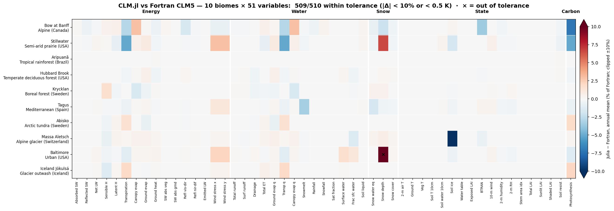
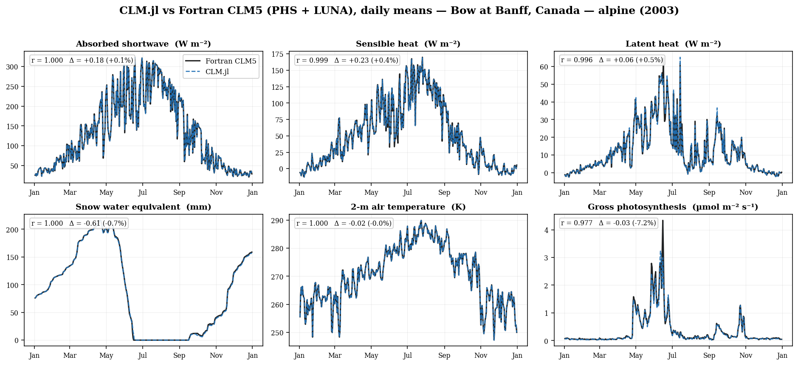
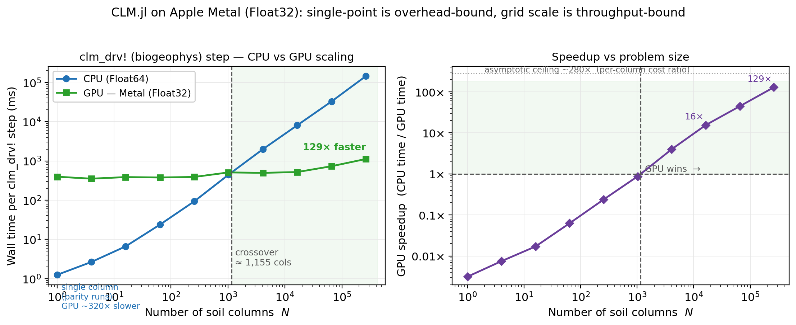

# CLM.jl

[](LICENSE)
[](https://julialang.org)
[]()

A differentiable Julia port of the [Community Land Model version 5](https://www.cesm.ucar.edu/models/clm/) (CLM5/CTSM) — the land surface component of the Community Earth System Model (CESM).

CLM.jl reproduces the full CLM5 biogeophysics in pure Julia, enabling **automatic differentiation** for gradient-based parameter calibration, **GPU-ready architecture** with BitVector masks, and **composability** with the Julia scientific ecosystem (ForwardDiff.jl, Enzyme.jl, Flux.jl, Optim.jl).

> ## ⚠️ Read this first: an agentic-engineering experiment
>
> **This codebase was written almost entirely by AI agents running in a continuous "[Ralph](https://ghuntley.com/ralph/)" loop.** No human has hand-written any meaningful amount of the code here, and the author has read only a small fraction of it. What you see is the output of a large amount of *agentic* engineering — autonomous agents reading the original Fortran, porting it, writing tests, validating against reference output, and iterating — supervised at the goal level, not the line level.
>
> This project exists to find out **what *can* be done** with agentic engineering on a serious scientific codebase — not to demonstrate what *should* be done. It is a probe into the limits of the approach, and should be read as such.
>
> **Implications you must take seriously:**
> - 🧪 **It is a research artifact, not production software.** Do not use it for science, operations, or decisions you care about without independent verification.
> - 🔍 **Validation is partial.** The numbers below are real, but they cover a limited slice (single-point sites, one year each, selected variables, biogeophysics only). Whole subsystems are implemented but unvalidated, and "tests pass" means the agents' own tests pass.
> - 🐛 **Expect latent bugs.** Plausible-looking code that no human has reviewed can be subtly or badly wrong in ways tests don't catch. Treat every result as suspect until you've checked it yourself.
> - 📝 **Provenance is unusual.** Much of the design rationale lives in agent logs and commit history rather than in a human's head.
>
> **Use entirely at your own risk.** No warranty, no guarantees of correctness, fitness, or scientific validity. If you build on this, verify everything.

## Validation Against Fortran CLM5 *(ongoing)*

CLM.jl is being checked against Fortran CLM5 (CTSM) across a growing suite of
single-point sites chosen to span distinct biomes. Each site runs a full year in
**PHS + LUNA** mode (plant hydraulic stress + photosynthetic acclimation),
initialized from a Fortran-generated spun-up restart, and the two daily history
series are compared variable-by-variable.



Current standing: across **20 biomes** and **69 output variables** (energy, water,
snow, state, carbon), essentially all biome × variable combinations meet the
coverage tolerance — **10 % relative** (or **0.5 K** for temperatures), with
per-unit absolute floors for near-zero quantities — and most agree to under 1 %.
The stricter scientific-parity gate (annual |Δ| ≤ 1 % / 0.05 K **and** daily
nRMSE ≤ 0.10 / 0.2 K) stands at **1348 of 1380** cells (97.7 %), with **11 of 20**
biomes fully strict, one documented exception (Baltimore `SNOW_DEPTH`, a small
snow-covered-area depth diagnostic), and 31 residuals traced — by single-step
oracle instrumentation — to coupled-solver floors or forcing-representation
limits rather than model bugs.

The heatmap collapses each variable to a single annual-mean error. To show what
the agreement looks like day-by-day, here is one site's full-year daily series —
Bow at Banff (alpine), with Fortran and CLM.jl overlaid across the snow
accumulation and melt cycle:



- This is agreement within 10 % (0.5 K for temperatures), **not bit-for-bit or
  machine-precision parity.** True numerical parity is a separate, harder goal
  and is not claimed here.
- These numbers are a **snapshot of ongoing work.** Several recent fixes were
  found by widening this comparison — a CO₂ partial-pressure bug, a wind-stress
  decomposition bug, a 1000× snow-compaction parameter — and more bugs likely
  remain.
- Each site is **one year, one configuration, a selected set of variables.**
  Whole subsystems (notably biogeochemistry) are not exercised by this suite.

Biomes covered so far: alpine (Bow at Banff), semi-arid prairie (Stillwater),
hot desert (Walnut Gulch), tropical rainforest (Aripuanã), tropical savanna
(Donga), larch permafrost taiga (Yakutia), temperate peat bog (Mer Bleue),
continental steppe (Kherlen), temperate deciduous forest (Hubbard Brook), Pacific
maritime conifer (HJ Andrews), boreal forest (Krycklan), Mediterranean (Tagus),
arctic tundra (Abisko), alpine glacier (Massa Aletsch), urban (Baltimore),
glacier outwash (Iceland), temperate broadleaf-evergreen (Eucalyptus/Tumbarumba),
boreal aspen (BOREAS), tropical páramo (Antisana), and cropland (Mead). The suite
(`scripts/parity_run_domain.jl` + scorecard)
is expanded as references are generated, so these numbers are a snapshot, not a
final result. See also [the warning above](#️-read-this-first-an-agentic-engineering-experiment).

## Features

### Biogeophysics (Validated)
- Surface albedo with two-stream canopy radiative transfer
- Snow radiative transfer (SNICAR) with aerosol-snow interactions
- Turbulent fluxes via Monin-Obukhov similarity (bare ground, canopy, lake, urban)
- Photosynthesis (Farquhar/Collatz) with Ball-Berry and Medlyn stomatal conductance
- LUNA photosynthetic optimization (Vcmax/Jmax acclimation)
- Plant hydraulic stress (PHS)
- Snow hydrology (12 layers, compaction, grain-size evolution)
- Soil hydrology (Richards equation, Clapp-Hornberger / van Genuchten)
- Soil temperature with phase change
- Lake temperature and hydrology
- Urban canyon energy balance (CLMU)
- Irrigation, hillslope lateral flow

### Biogeochemistry (Implemented; CN core validated at ONE site. Fire/CH4 diffed for the first time — and they FAILED)
- Carbon-nitrogen cycling (CN mode) with allocation, respiration
- Decomposition (Century cascade and MIMICS)
- Nitrification-denitrification, nitrogen leaching
- Fire (Li 2014 / **2016** / 2021 / 2024), gap mortality, dynamic vegetation (CNDV)
- Methane (CH4), VOC emissions, dust emission

**What is actually validated** (see [`docs/BGC_PARITY_SCORECARD.md`](docs/BGC_PARITY_SCORECARD.md)):
the **CN core** — allocation, phenology, litterfall, decomposition, mineral N — is diffed
against the instrumented Fortran CTSM at the **Bow-at-Banff single column only** (3 patches:
bare, needleleaf evergreen tree, C3 arctic grass), from a converged BGC spinup:

| | result |
|---|---|
| Single-step parity, winter / summer / **autumn leaf-offset** windows | worst CN `max\|rel\|` **5.9e-05 / 2.2e-03 / 2.2e-03** |
| Leaf-offset litterfall flux through the 15-day senescence ramp | Julia/Fortran ratio **1.0000** at every step |
| Multi-step drift (inject once, free-run 480 steps through senescence) | **bounded, near-linear**; leafc rel 4e-05 → 2e-02 |
| `use_cn` cold start vs a Fortran CN cold start | **bit-exact** (worst rel 0.0) |

Generating the **autumn / leaf-offset window** — which had never existed, and which a
summer-only window is structurally blind to (`offset_flag == 0` all summer) — exposed and
fixed four real bugs, including a wiped litterfall-ramp memory that made leaf senescence
~2–7% of its correct rate, and a cold start that gave evergreen PFTs **no canopy at all**.

#### Fire and methane — first-ever Fortran diff (see [`docs/CH4_FIRE_PARITY.md`](docs/CH4_FIRE_PARITY.md))

Fire and methane had **never** been compared to Fortran — not because it was hard, but
because the reference run had `use_lch4=.false.` and `fire_method='nofire'`, so **neither
subsystem ever ran in Fortran either**. A new reference (`use_lch4=.true.`,
`fire_method='li2016crufrc'`) and two new dump boundaries (`after_ch4`, `after_fire`) now
exist. Turning the lights on found, and this PR fixed, **ten real bugs** — including three
that were silently corrupting **every** CLM.jl run, fire or not:

- **`forc_rh_grc` was identically ZERO in every run, ever.** The forcing reader never wrote
  `forc_q_not_downscaled_grc`, the sole input to `atm2lnd_update_rh!`. Relative humidity was
  dead model-wide (Bow: 0 → **44.9 %**).
- **`soil_bgc_carbon_flux_summary!` was never called** — so **all heterotrophic respiration
  (`somhr`/`lithr`/`hr_vr`) was identically ZERO**, which in turn made CH4 production zero.
- **`cnveg_carbon_state_summary!`'s column `p2c` was stubbed** → `totvegc_col` was
  allocate-NaN forever (and is a live input to the fire fuel load).
- **`rgasm` was 1000× too small** (a `/1000` applied twice) — *every* CH4/O2/CO2 atmospheric
  boundary concentration was **1000× too large**.
- **`finundated` was frozen at 0.1 forever** — CTSM's `CalcFinundated` was never ported.
- **Three `CH4VarCon` defaults were the OPPOSITE of CTSM's** (`anoxicmicrosites`,
  `ch4rmcnlim`, `use_aereoxid_prog`) — the Julia methane model was a *different model*.
- **The entire Li fire chain was dead**: `_fire_active` was structurally unreachable, the
  seven fire structs were never instantiated, and lightning/popdens/GDP/peat had no reader.
  Now wired (default `:nofire` stays bit-identical). Plus an `fd_pft` **off-by-one** and
  NaN-initialised `prec10/30/60`/`rh30` accumulators.

**Status after the fixes — honest:**

| | |
|---|---|
| **Fire — Li2016 formula** | `LGDP`, `LGDP1`, `LPOP`, `FSR`, `FD`, `WTLF` **EXACT (0.0)**; `FUELC` 2e-06. The whole fire C/N combustion chain is exact **up to `farea_burned`** (every flux carries its error identically). **19/29 fields exact.** |
| **Fire — `NFIRE`/`FAREA_BURNED`** | **DIVERGE** (rel 1.2 / 4.8). Localized to `fire_m`, whose `rh30` input cannot be reproduced because **CLM.jl's accumulator restart I/O is unported**. NOT validated. |
| **Methane** | **NOT validated.** Production and the O2 boundary now agree to the right order (from 1000× out / identically zero); the **transport + aerenchyma half is still badly wrong** (`grnd_ch4_cond` is stuck at its cold-start 0.01 — the driver passes a placeholder). **11/33 within 1e-9, 8 of those vacuous.** |
| **Methane as a SOURCE** | **UNTESTED.** Bow is dry: `finundated ≡ 0`, so the column is a net CH4 *sink*. The wetland regime — the one that matters — needs a peatland site. |

**NOT validated against Fortran:** any site other than Bow; **isotopes, CNDV, MIMICS, and VOC
(never diffed at all)**; crop BGC; multi-year trajectories; and — per the table above — fire's
burned area and methane's transport.

### FATES Ecosystem Demography (Ported and Running — Parity NOT Established)
[FATES](https://github.com/NGEET/fates) (size- and age-structured cohort
demography — the alternative vegetation model to CN) is ported and runs live
through the timestep driver under `use_fates`: cohorts photosynthesize, grow,
compete for light, and are recruited and killed, on the official FATES parameter
file. Treat this as the **least validated** part of the codebase:

- **No Fortran-FATES bit-parity.** Nothing here has been compared against a
  Fortran FATES run — that reference is blocked on staging DATM forcing for a
  FATES-enabled Fortran case. What exists is internal consistency plus
  multi-site equilibrium behaviour checks (`scripts/fates_multisite_validation.jl`,
  `scripts/fates_fortran_parity.jl` is a scaffold awaiting the reference).
- Some FATES paths remain gated off (notably plant hydraulics), and the
  numbers it produces have not been checked against anything authoritative.

If the caveats at the top of this README apply anywhere, they apply here.

### AD & Calibration
- All 50+ data structs parameterized on `{FT<:Real}` for dual-number propagation
- ~520 smoothed discontinuities (`smooth_max`, `smooth_min`, `smooth_heaviside`)
- Pure-Julia LU fallback for banded matrix solves with Dual numbers
- Built-in `CalibrationProblem` framework with ForwardDiff gradients
- 7 tunable parameters: `vcmax25_scale`, `medlyn_slope`, `csoilc`, `jmax25top_sf`, `baseflow_scalar`, `fff`, `ksat_scale`

## Quick Start

```julia
using CLM

# Run a full simulation
clm_run!(
    fsurdat  = "path/to/surfdata.nc",
    paramfile = "path/to/params.nc",
    fforcing  = "path/to/forcing/",
    fhistory  = "output/history.nc"
)

# Or initialize and step manually
inst, bounds, filt, tm = clm_initialize!(
    fsurdat  = "path/to/surfdata.nc",
    paramfile = "path/to/params.nc"
)
clm_drv!(config, inst, filt, filt_ia, bounds, ...)
```

## Gradient-Based Calibration

```julia
using CLM, ForwardDiff

prob = CalibrationProblem(
    params = [
        CalibrationParameter("vcmax25_scale", 1.0, setter!, (0.5, 2.0)),
        CalibrationParameter("medlyn_slope", 4.1, setter!, (1.0, 10.0)),
    ],
    targets = [CalibrationTarget("LH", getter, obs_LH, 1.0)],
    fsurdat = "surfdata.nc",
    paramfile = "params.nc",
    fforcing = "forcing/"
)

# AD gradients + Armijo line search
result = calibrate(prob; maxiter=20)
```

## Architecture

```
src/
  constants/       Physical constants, control flags, PFT parameters
  types/           50+ mutable structs (SoA layout, {FT<:Real} parameterized)
  infrastructure/  Solvers, I/O, initialization, filters, subgrid
  biogeophys/      Radiation, turbulence, hydrology, snow, soil, photosynthesis
  biogeochem/      Phenology, decomposition, nutrient cycling, fire, CH4, VOC
  driver/          Timestep driver, initialization, top-level run
  calibration/     AD-based calibration framework
```

**Key design decisions:**
- **SoA (Structure of Arrays)** layout matching Fortran CLM for GPU compatibility
- **BitVector masks** replace Fortran integer filter arrays — no dynamic rebuild, GPU-ready
- **Fortran variable names preserved** for line-by-line traceability (`h2osoi_liq`, `t_soisno`, etc.)
- **Fixed-size snow arrays** padded to `nlevsno=12` — no dynamic resizing

## Performance

| Configuration | Wall-clock (1 year, single-point) |
|---|---|
| Fortran CLM5 (ifort -O2) | ~2 s |
| CLM.jl (Float64) | ~4 s |
| CLM.jl + ForwardDiff (1 param) | ~8 s |
| CLM.jl + ForwardDiff (7 params) | ~28 s |

### GPU (Metal) — where it helps

The `clm_drv!` timestep also runs on Apple Metal (Float32), and a full annual single-point
run reproduces the Fortran reference to the same tolerance as the CPU path (69/69 variables).
For point-scale work like the parity runs above, though, the CPU is far faster: a single
column is the GPU's worst case — hundreds of tiny kernel launches with no parallel work to
hide the overhead. The GPU only earns its keep once there are enough columns to fill it.



Timing one `clm_drv!` biogeophysics step as the column count grows, CPU time scales linearly
while the GPU sits near a fixed launch/marshaling floor until it saturates — crossing over
around **~1,150 columns** and reaching **~130×** by 260k columns (trending toward a ~280×
per-column ceiling). So single points belong on the CPU; grid- to continental-scale runs are
where on-device execution pays off. This is an early, indicative measurement — Apple M-series
laptop, Float32, min-of-trials — not a tuned benchmark. (`scripts/gpu_scaling_bench.jl`)

## Testing

```bash
julia --project=. -e 'using Test; include("test/runtests.jl")'
```

15,528 tests: unit tests, end-to-end SP simulation, AD gradient verification (6 climate scenarios), calibration framework, parameter recovery, CN integration, and Enzyme feasibility.

## Requirements

- Julia 1.10+
- NCDatasets.jl, ForwardDiff.jl, JSON.jl
- CLM5 surface data and parameter files (NetCDF)

## How This Was Built — The Ralph Loop

CLM.jl is, first and foremost, an experiment in **agentic software engineering**. The porting work was driven by a [Ralph-style loop](https://ghuntley.com/ralph/): an AI coding agent run repeatedly against a standing set of instructions, each iteration picking up the next unit of work, reading the original Fortran, writing the Julia translation, adding tests, validating, and committing — with a human steering goals and priorities rather than authoring code.

The working pattern, roughly:

1. **Read the Fortran completely** for the target module (`/installs/clm/`).
2. **Translate** to Julia following the conventions in [`CLAUDE.md`](CLAUDE.md) (SoA layout, preserved variable names, BitVector masks).
3. **Test** — unit tests plus finite-difference derivative checks where applicable.
4. **Validate** against reference Fortran output where a harness exists.
5. **Iterate** until parity, then move to the next module. Repeat, autonomously, for a long time.

Some of the larger pushes (GPU kernelization, reverse-mode AD, BGC subsystems) were run as multi-agent workflows — fan-out batches of agents working in parallel, with adversarial verification passes. The accumulated decisions, dead-ends, and lessons live in the commit history, [`PORTING_LOG.md`](PORTING_LOG.md), and the agents' own memory.

**What this means for you:**

- The code is **idiomatic and traceable** because the loop was told to keep it that way — but consistency is not correctness.
- Coverage is **broad but uneven.** Biogeophysics is the most exercised; biogeochemistry is implemented but largely unvalidated.
- If you find a bug, you are likely the **first human to look at that code closely.** Issues and fixes are very welcome (see [Contributing](#contributing)).

This is shared in the spirit of finding out what is possible. Calibrate your trust accordingly.

## Citation

If you use CLM.jl, please cite the repository:

> Eythorsson, D. (2026). *CLM.jl: A differentiable Julia port of the Community Land Model.* https://github.com/DarriEy/CLM.jl

## Contributing

Issues and pull requests are welcome. Please run the full test suite before submitting changes:

```bash
julia --project=. -e 'using Test; include("test/runtests.jl")'
```

## License

The original contributions in this repository (the Julia translation, AD/GPU
work, test and parity harnesses) are licensed under the [MIT License](LICENSE).

CLM.jl is a port — and therefore a derivative work — of the Fortran CTSM/CLM5
source, which is distributed by UCAR/NCAR under a BSD 3-Clause license. That
upstream copyright notice and license are retained in the [NOTICE](NOTICE) file
and continue to govern the portions of this work derived from CTSM.

## Acknowledgements

CLM.jl is based on the [Community Land Model](https://github.com/ESCOMP/CTSM) developed by the National Center for Atmospheric Research (NCAR) and the broader CESM community. The original Fortran CLM5 is described in Lawrence et al. (2019).
