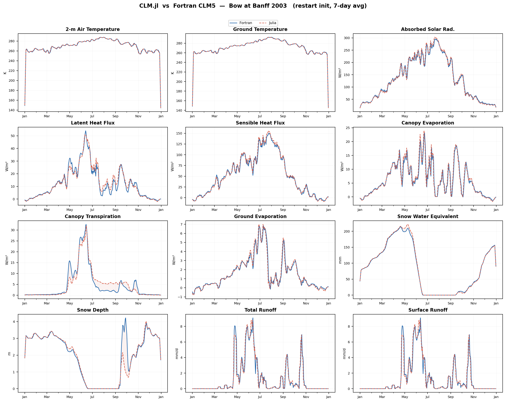

# CLM.jl

A Julia port of the Community Land Model (CLM5/CTSM) — the land surface component of the Community Earth System Model (CESM).

CLM.jl reproduces CLM5 physics in pure Julia, enabling automatic differentiation (AD) for gradient-based parameter calibration, GPU execution, and composability with the Julia scientific ecosystem.

## Parity with Fortran CLM5

CLM.jl has been validated against Fortran CLM5 for a full-year simulation at the Bow at Banff site (2003, restart-initialized from a 2002 cold-start spinup). The figure below shows 7-day running averages for 12 key output variables:



| Variable | Bias |
|---|---|
| 2-m Air Temperature | +0.01 K |
| Absorbed Solar Radiation | +0.5% |
| Latent Heat Flux | +3% |
| Canopy Transpiration | +12% |
| Sensible Heat Flux, Ground Temperature, Snow, Runoff | < 5% |

## Features

- **Full SP mode**: Satellite phenology mode runs end-to-end with all biogeophysics processes
- **CN/BGC mode**: Carbon-nitrogen biogeochemistry with decomposition cascade (BGC and MIMICS)
- **AD-ready**: All 50+ data structs parameterized on `{FT<:Real}`, ~520 smoothed discontinuities, ForwardDiff-compatible
- **Calibration framework**: `CalibrationProblem` with ForwardDiff gradients, parameter recovery tests, multi-timestep evaluation
- **LUNA**: Photosynthesis optimization (Vcmax/Jmax acclimation)
- **PHS**: Plant hydraulic stress
- **SNICAR**: Snow radiative transfer (aerosol-snow interactions)
- **CH4**: Methane biogeochemistry
- **VOC**: Volatile organic compound emissions
- **Fire**: Li 2014 fire model
- **Irrigation**: Demand-driven irrigation
- **CNDV**: Dynamic vegetation (CN mode)
- **Restart I/O**: Full restart read/write for multi-year simulations

## Quick Start

```julia
using CLM

# Run a full simulation
clm_run!(
    fsurdat  = "path/to/surfdata.nc",
    paramfile = "path/to/params.nc",
    fforcing  = "path/to/forcing/",
    fhistory  = "output/history.nc"
)

# Or initialize and step manually
inst, bounds, filt, tm = clm_initialize!(
    fsurdat  = "path/to/surfdata.nc",
    paramfile = "path/to/params.nc"
)
clm_drv!(config, inst, filt, filt_ia, bounds, ...)
```

## Calibration

```julia
using CLM, ForwardDiff

prob = CalibrationProblem(
    fsurdat = "surfdata.nc",
    paramfile = "params.nc",
    fforcing = "forcing/",
    params = [:vcmax25_scale, :medlyn_slope, :baseflow_scalar],
    obs = observations
)

# Gradient-based optimization with AD
result = calibrate(prob)
```

## Architecture

```
src/
  constants/     Physical constants, control flags, PFT parameters
  types/         50+ mutable structs (SoA layout, {FT<:Real} parameterized)
  infrastructure/ Solvers, I/O, initialization, filters, subgrid
  biogeophys/    Radiation, turbulence, hydrology, snow, soil, photosynthesis
  biogeochem/    Phenology, decomposition, nutrient cycling, fire, CH4, VOC
  driver/        Timestep driver, initialization, top-level run
  calibration/   AD-based calibration framework
```

## Testing

```bash
julia --project=. -e 'using Test; include("test/runtests.jl")'
```

15,500+ tests covering unit tests, integration tests, AD gradient checks, calibration scenarios, and parameter recovery.

## Requirements

- Julia 1.10+
- NCDatasets.jl, ForwardDiff.jl, JSON.jl

## License

See LICENSE file.
